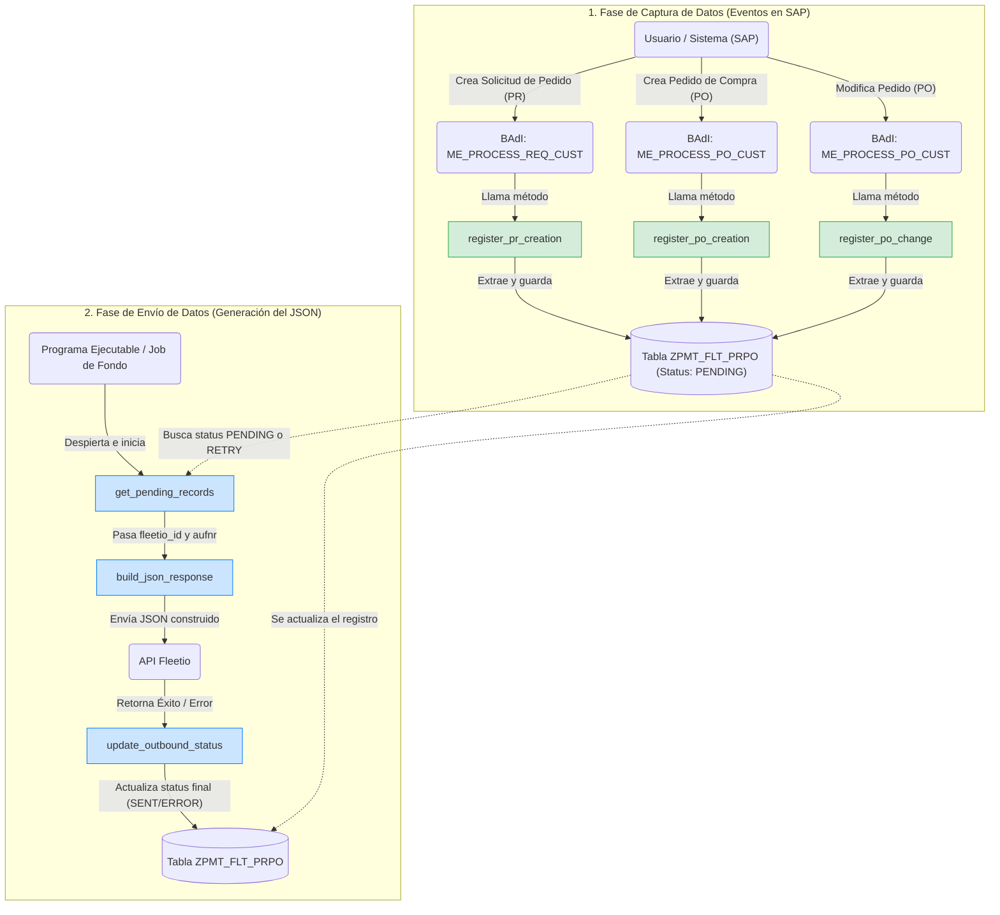

# Diagrama de Flujo: Inicio del Proceso WorkOrderPR

Este diagrama representa visualmente las dos fases descritas en el documento `inicio_proceso_workorderpr.md`.

### Descripción del Diagrama:
*   **Fase 1 (Verde):** Detalla cómo las BAdIs actúan como el gatillo inicial (trigger) para capturar los datos y depositarlos en la tabla transaccional con estatus `PENDING`.
*   **Fase 2 (Azul):** Ilustra cómo el programa de fondo toma el control a partir de `get_pending_records`, realiza el ensamblado del JSON y finalmente cierra el ciclo de vida del registro actualizando la tabla.
